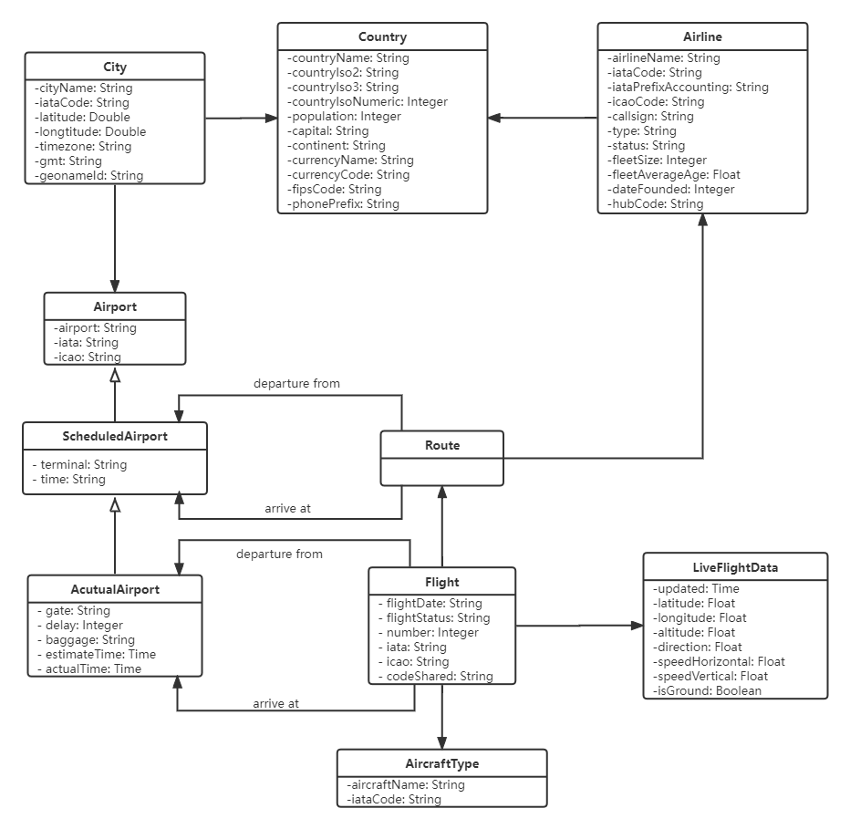

## Class diagram

This UML class diagram describes the attributes and behaviour of the class of flight API.  
The Country class is bidirectionally associated with the City class and the Airline class. By placing a multiplicity expression, a Country can be associated with 0 to many Cities, and a Country can also be associated with 0 to many Airlines. Also, there are one or more cities in a country or none of the cities are in the Country class. There may be one or many airlines operating within a Country class at the same time, or none at all.   
The City class and the Airport class are bidirectionally associated. A city may not have an airport, or it may have one or even multiple airports, and vice versa.  
There is an inheritance relationship between ScheduleAirport class and Airport class. Airport class is the parent object and ScheduleAirport class is the child object. Additionally, ScheduleAirport class and AcutualAirport class have an inheritance connection where ScheduleAirport class is the parent object and AcutualAirport class is the child object. Therefore, we can know that the AcutualAirport class is a grandchild of the Airport class.  
Route class directed association with Airline class. Indicates that each route has an airline. And the Route class is also directly associated with the ScheduleAirport class, indicating that each route has a way to arrive at a schedule-airport or has a way to departure from a schedule-airport.  
The last is the Flight class, which calls the Route class, LiveFlightData class, AircraftType class, and AcutualAirport class respectively. A flight needs to know the route information from the Route class, to query the real-time data of the flight from the LiveFlightData class, to get the current aircraft type information from the AircraftType class, and know the airport location of the arrival airport and departure airport through the AcutualAirport class.  
